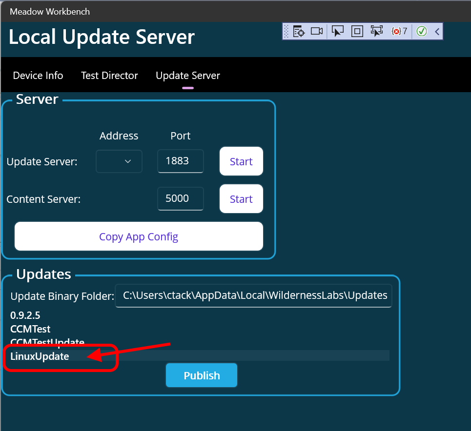

# Linux App OtA Updates

The Meadow Update Service infrastructure can be used to update applications on Linux, even if they are not using the Meadow software stack.

Currently we offer an SDK that provides easy access to UpdateService infrastructure for any .NET application, but the service is not dependent on .NET and additional language SDKs will be available in the future.

## Meadow.Daemon

The cornerstone of providing Meadow.Cloud features to applications on Linux is the Meadow.Daemon.  This is a simple, open-source daemon written in Rust that provides [intuitive REST endpoints](daemon-api.md) for applications to interact with both Meadow.Cloud and the local device.

All Meadow.Cloud SDKs are simply open-source convenience wrappers around these endpoints.

[list SDKs here]

## Basics of App Updates

## Sample Application Update (local)

The Meadow Update Service architecture does not require Meadow.Cloud to operate.  You can do completely on-premise updates using something like Meadow.Workbench as the update server.

### Create a local update package (MPAK)

Using the LinuxConsoleSample all, change the VersionString to something like "2.0".  Compile the application and then open the output directory.  We're after the compiled App.dll assembly.

Create a zip file named "update.zip" with a single subfolde called "app" and put App.dll in that folder.

```
+ app
  - App.dll
```

Now copy that zip file to and update source folder for Workbench at

%AppData%\Local\WildernessLabs\Updates\LinuxUpdate

If you run Workbench, you should see the update as available.




### Start the update server

In Workbench

- Select the Update Server address (probably a 172.xxx.xxx.xxx number)
- start the update server
- start the content server


### Run the daemon


### Run the Application

- app will clear the updates store in the daemon
- Change the VersionString back to something like "1.0" and run the application.
- Check the output folder to make sure only a "1.0.txt" fle exists (not 2.0.txt)

### Publish the Update

In Workbench

- Select the update
- click "Publish"

### Check progress

In the console app, you will have:

```
Clearing update store...
An update is available! (ID: LinuxUpdate)
Retrieving Update ID 'LinuxUpdate')
An update has been retrieved! (ID: LinuxUpdate)
Applying update ID 'LinuxUpdate')
An update has changed! (ID: LinuxUpdate)
```

### Stop the console app (change to auto?)

The damon will apply the update (copy to the app folder) when the app is shut down


## Sample Application Update (Meadow.Cloud)